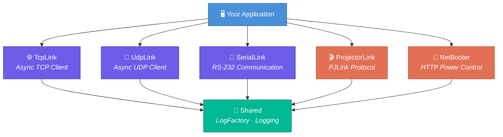

# 🔗 ThreeByte.LinkLib

**A family of .NET communication libraries for TCP, UDP, Serial, projector control (PJLink), and networked power management (NetBooter).**

[](https://dotnet.microsoft.com)
[](LICENSE)
[](https://www.nuget.org/profiles/olaaf)

---

## 📦 Packages

| Package | NuGet | Description |
|---------|-------|-------------|
| 🌐 [**TcpLink**](ThreeByte.LinkLib/ThreeByte.LinkLib.TcpLink/) | [](https://www.nuget.org/packages/ThreeByte.LinkLib.TcpLink) | Async TCP client with auto-reconnect and message queuing |
| 📡 [**UdpLink**](ThreeByte.LinkLib/ThreeByte.LinkLib.UdpLink/) | [](https://www.nuget.org/packages/ThreeByte.LinkLib.UdpLink) | Async UDP client with configurable local/remote endpoints |
| 🔌 [**SerialLink**](ThreeByte.LinkLib/ThreeByte.LinkLib.SerialLink/) | [](https://www.nuget.org/packages/ThreeByte.LinkLib.SerialLink) | RS-232 serial communication with optional frame-based protocol |
| 🎬 [**ProjectorLink**](ThreeByte.LinkLib/ThreeByte.LinkLib.ProjectorLink/) | [](https://www.nuget.org/packages/ThreeByte.LinkLib.ProjectorLink) | PJLink protocol client for projector power control and queries |
| 🔋 [**NetBooter**](ThreeByte.LinkLib/ThreeByte.LinkLib.NetBooter/) | [](https://www.nuget.org/packages/ThreeByte.LinkLib.NetBooter) | Synaccess NetBooter networked power outlet controller |
| 🧩 [**Shared**](ThreeByte.LinkLib/ThreeByte.LinkLib.Shared/) | [](https://www.nuget.org/packages/ThreeByte.LinkLib.Shared) | Shared logging infrastructure (auto-included as dependency) |

---

## ✨ Features

- **Asynchronous** — Non-blocking I/O across all transport layers
- **Thread-Safe** — Lock-protected operations for concurrent access
- **Message Queuing** — FIFO queues (up to 100 messages) for reliable retrieval
- **Event-Driven** — Rich events for connection changes, data arrival, and errors
- **Auto-Reconnect** — TCP and Serial links recover automatically from failures
- **Cross-Platform** — Targets .NET 10.0, .NET Standard 2.0, and .NET Standard 2.1

---

## 📥 Installation

Install only the packages you need:

```powershell
dotnet add package ThreeByte.LinkLib.TcpLink
dotnet add package ThreeByte.LinkLib.UdpLink
dotnet add package ThreeByte.LinkLib.SerialLink
dotnet add package ThreeByte.LinkLib.ProjectorLink
dotnet add package ThreeByte.LinkLib.NetBooter
```

---

## 🚀 Quick Start

### TCP — Connect to a device

```csharp
using ThreeByte.LinkLib.TcpLink;

var tcp = new AsyncTcpLink("192.168.1.100", 5000);
tcp.DataReceived += (s, e) => Console.WriteLine($"Got {tcp.GetMessage()?.Length} bytes");

byte[] cmd = System.Text.Encoding.ASCII.GetBytes("HELLO\r\n");
tcp.SendMessage(cmd);
```

### UDP — Fire-and-forget datagrams

```csharp
using ThreeByte.LinkLib.UdpLink;

var udp = new AsyncUdpLink("192.168.1.50", remotePort: 9000, localPort: 9001);
udp.SendMessage(System.Text.Encoding.ASCII.GetBytes("PING"));
```

### Serial — Talk to RS-232 devices

```csharp
using ThreeByte.LinkLib.SerialLink;

var serial = new SerialLink("COM3", baudRate: 9600);
serial.SendData(new byte[] { 0x01, 0x02, 0x03 });
```

### Projector — PJLink power control

```csharp
using ThreeByte.LinkLib.ProjectorLink;

using var projector = new Projector("192.168.1.200");
projector.TurnOn();
PowerStatus status = projector.GetState();
string info = projector.GetInfo();  // "Epson EB-L1755U (Main Hall)"
```

### NetBooter — Remote power outlet control

```csharp
using ThreeByte.LinkLib.NetBooter;

var netBooter = new NetBooterLink("192.168.1.10");
netBooter.Power(outlet: 1, state: true);   // Turn on outlet 1
netBooter.PollState();
bool isOn = netBooter[1];                  // Check outlet state
```

---

## 🏗️ Architecture



---

## 📋 How to Build and Publish NuGet Packages

1. Create a new branch and make your changes in any `ThreeByte.LinkLib.*` folder
2. Commit and push to GitHub
3. Create a pull request to `main` and attach a label:
   - `major` — breaking changes
   - `minor` — new features
   - `patch` — bug fixes

   > We follow [Semantic Versioning](https://semver.org/)

4. Merge your pull request
5. Your NuGet package will be available on [nuget.org](https://www.nuget.org/profiles/olaaf) within ~5 minutes

---

## 🤝 Contributing

Contributions are welcome! Please fork the repository and submit a pull request with your changes.

---

## 📄 License

This project is licensed under the MIT License — see the [LICENSE](LICENSE) file for details.

MIT License

Copyright (c) 2025 Three Byte

Permission is hereby granted, free of charge, to any person obtaining a copy
of this software and associated documentation files (the "Software"), to deal
in the Software without restriction, including without limitation the rights
to use, copy, modify, merge, publish, distribute, sublicense, and/or sell
copies of the Software, and to permit persons to whom the Software is
furnished to do so, subject to the following conditions:

The above copyright notice and this permission notice shall be included in all
copies or substantial portions of the Software.

THE SOFTWARE IS PROVIDED "AS IS", WITHOUT WARRANTY OF ANY KIND, EXPRESS OR
IMPLIED, INCLUDING BUT NOT LIMITED TO THE WARRANTIES OF MERCHANTABILITY,
FITNESS FOR A PARTICULAR PURPOSE AND NONINFRINGEMENT. IN NO EVENT SHALL THE
AUTHORS OR COPYRIGHT HOLDERS BE LIABLE FOR ANY CLAIM, DAMAGES OR OTHER
LIABILITY, WHETHER IN AN ACTION OF CONTRACT, TORT OR OTHERWISE, ARISING FROM,
OUT OF OR IN CONNECTION WITH THE SOFTWARE OR THE USE OR OTHER DEALINGS IN THE
SOFTWARE.
